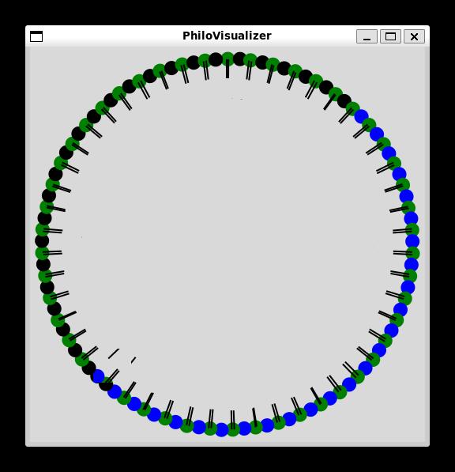

# 42cursus-philosophers--visualizer

 

このビジュアライザーはおそらく課題には役に立ちませんが哲学者たちの動きを見て楽しむために製作しました

## 使い方
シミュレーションを開始する前にこの関数を呼びます
```
philovisualizer_init([哲学者とフォークの数], [ボーナスかどうか]);
```
※ボーナスは現在非対応です

哲学者の状態が変化する度にこの関数を呼びます
```
//	PV_THINKING
//	PV_EATING
//	PV_SLEEPING
//	PV_DIED
//	PV_TAKE_LEFT
//	PV_PUT_LEFT
//	PV_TAKE_RIGHT
//	PV_PUT_RIGHT

//	PVB_TAKE
//	PVB_PUT

philovisualizer_send([哲学者の番号], [上のいずれか])
```

バックグラウンドで実行してから実行します
```
./philo_visualizer.py &
./philo ...
```

thnkingが黒、eating,が緑、sleepingが青、deiedが赤で表示されます
